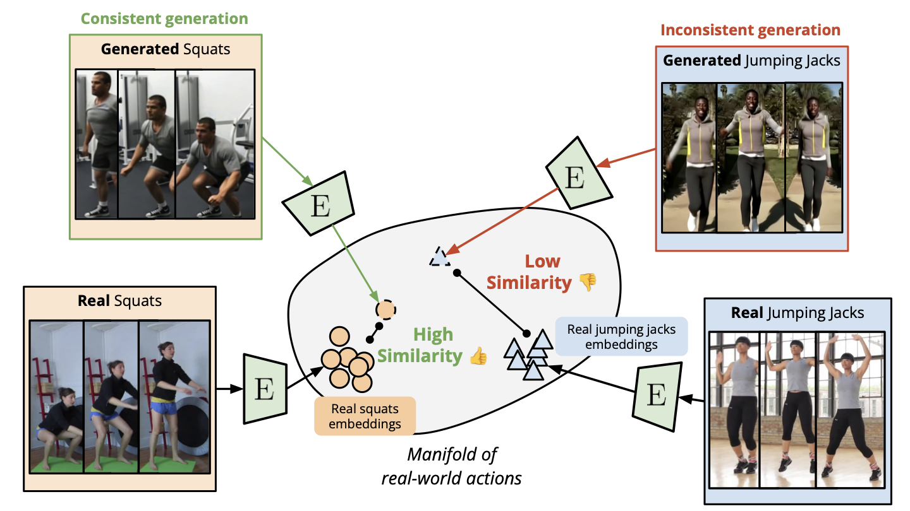
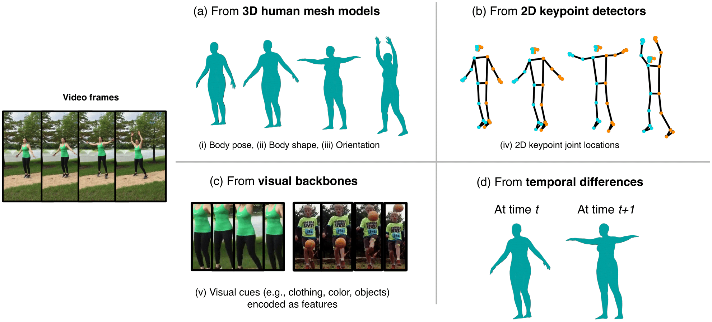
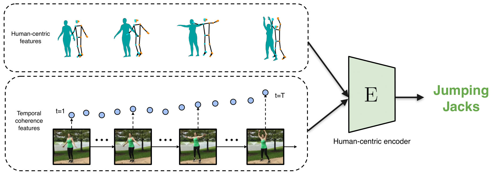
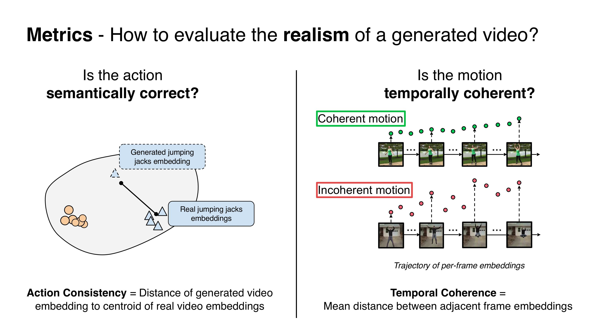

# Generative Action Tell-Tales: Assessing Human Motion in Synthesized Videos

<p align="center">
  <strong>ECCV 2026</strong>
</p>

<p align="center">
  <a href="https://xavierohan.github.io">Xavier Thomas</a><sup>1</sup>,
  <a href="https://sgt-lim.github.io">Youngsun Lim</a><sup>1</sup>,
  <a href="https://www.linkedin.com/in/ananya-srinivasann">Ananya Srinivasan</a><sup>2*</sup>,
  <a href="https://www.linkedin.com/in/audrey-zheng-6443b5314/">Audrey Zheng</a><sup>3*</sup>,
  <a href="https://deeptigp.github.io">Deepti Ghadiyaram</a><sup>1,4</sup>
  <br>
  <sub>
    <sup>1</sup>Boston University ·
    <sup>2</sup>Belmont High School ·
    <sup>3</sup>Canyon Crest Academy ·
    <sup>4</sup>Runway ·
    <sup>*</sup>Equal contribution
  </sub>
</p>

<p align="center">
  <a href="https://arxiv.org/abs/2512.01803"></a>
  <a href="https://xthomasbu.github.io/video-gen-evals/"></a>
  <a href="https://eccv.ecva.net/"></a>
  <a href="https://huggingface.co/papers/2512.01803"></a>
  <a href="https://huggingface.co/datasets/dghadiya/TAG-Bench-Video"></a>
</p>

<p align="center">
  <strong>Key idea: Judge realism by looking at how real humans perform an action</strong>
</p>

<p align="center">
  
</p>

<p align="center">
  <sub>We learn a human-centric embedding space where consistent generated videos lie close to real videos of the same action, while inconsistent generated videos lie further away.</sub>
</p>

---

## Overview

Despite rapid advances in video generative models, robust metrics for evaluating visual and temporal correctness of complex human actions remain elusive. Existing video metrics and MLLMs are strongly appearance-biased and struggle to discern intricate motion dynamics and anatomical implausibilities.

We learn a human-centric embedding space of real-world actions by fusing appearance-agnostic skeletal geometry with appearance-based features, then score a generated video by how close its representations lie to this real-action distribution.

Our benchmark is available at [TAG-Bench](https://huggingface.co/datasets/dghadiya/TAG-Bench-Video).

## Abstract

Despite rapid advances in video generative models, robust metrics for evaluating visual and temporal correctness of complex human actions remain elusive. Critically, existing pure-vision encoders and Multimodal Large Language Models (MLLMs) are strongly appearance-biased, lack temporal understanding, and thus struggle to discern intricate motion dynamics and anatomical implausibilities in generated videos. We tackle this gap by introducing a novel evaluation metric derived from a learned latent space of real-world human actions. Our method first captures the nuances, constraints, and temporal smoothness of real-world motion by fusing appearance-agnostic human skeletal geometry features with appearance-based features. We posit that this combined feature space provides a robust representation of action plausibility. Given a generated video, our metric quantifies its action quality by measuring the distance between its underlying representations to this learned real-world action distribution. For rigorous validation, we develop a new multi-faceted benchmark specifically designed to probe temporally challenging aspects of human action fidelity. Through extensive experiments, we demonstrate that our metric achieves substantial improvement of over 68% over existing state-of-the-art methods on our benchmark, performs competitively on established external benchmarks, and has a stronger correlation with human perception.

## Method

<p align="center">
  
</p>

<p align="center">
  <sub><b>Break human motion down to its intrinsics</b> — 3D mesh pose/shape/orientation, 2D keypoints, visual cues, and temporal differences.</sub>
</p>

<p align="center">
  
</p>

<p align="center">
  <sub><b>Human-centric encoder.</b> Appearance-agnostic geometry and temporal features are fused to learn what constitutes a plausible action.</sub>
</p>

<p align="center">
  
</p>

<p align="center">
  <sub><b>Metrics.</b> Action Consistency measures distance to the real-action embedding centroid; Temporal Coherence measures smoothness of per-frame embedding trajectories.</sub>
</p>

## Quick Start

### 1. Setup Dependencies

```bash
# Clone TokenHMR
git clone https://github.com/saidwivedi/TokenHMR.git
cd TokenHMR
# Download TokenHMR models and requirements per their instructions

# Clone DWpose
git clone https://github.com/IDEA-Research/DWPose.git
# Download DWpose models and requirements per their instructions
```

**Required modifications** (apply after cloning):

1. **TokenHMR**:
    - Add `modifications/mesh_generator.py` to `TokenHMR/tokenhmr/mesh_generator.py`
    - Update `TokenHMR/tokenhmr/lib/models/heads/token_head.py` — modify `SMPLTokenDecoderHead` as shown in `modifications/token_head.py`

2. **DWpose**:
   - Update `DWPose/ControlNet-v1-1-nightly/annotator/process_video.py` as shown in `modifications/process_video.py`
   - Update `DWPose/ControlNet-v1-1-nightly/annotator/dwpose/__init__.py` as shown in `modifications/dwpose_init.py`

### 2. Extract Meshes

Update in `extract_mesh.py`:
```python
DIR = "PATH_TO_VIDEOS"
```

```bash
python extract_mesh.py
```

### 3. Extract Keypoints

Update in `DWPose-onnx/ControlNet-v1-1-nightly/annotator/process_video.py`:
```python
VID_DIR = "PATH_TO_VIDEOS"
POSE_SAVE_PATH = "PATH_TO_SAVE_KEYPOINTS"
```

```bash
cd DWPose-onnx/ControlNet-v1-1-nightly/annotator
python process_video.py
```

### 4. Configure Paths

Edit `GLOBAL_CONFIG` in `train.py`:
```python
"paths": {
    "mesh_human_data_real": "/path/to/real_meshes",
    "mesh_human_data_generated": "/path/to/generated_meshes",
    "real_kp_dir": "/path/to/real_keypoints",
    "gen_kp_dir": "/path/to/generated_keypoints",
}
```

## Training

```bash
python train.py
```

## Citation

If you find this code useful, please cite our paper:

```bibtex
@article{thomas2025generative,
  title={Generative Action Tell-Tales: Assessing Human Motion in Synthesized Videos},
  author={Thomas, Xavier and Lim, Youngsun and Srinivasan, Ananya and Zheng, Audrey and Ghadiyaram, Deepti},
  journal={arXiv preprint arXiv:2512.01803},
  year={2025}
}
```
